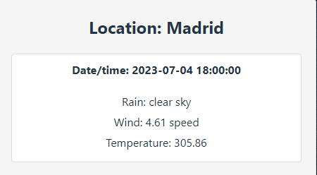
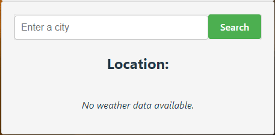

# React-Weather-API

Hola a tod@s!

Os voy a ir contando paso a paso la funcionalidad de este ejercicio realizado con React!

Teneis 2 opciones para poder visualizar el ejercicio:

1. La mas sencilla es que puedas ver la funcionalidad del proyecto a través del siguiente enlace el cual te llevará al despliegue que realice en Netlify y puedas navegar directamente sin necesidad de instalar nada:

- https://main--funny-blini-f3366e.netlify.app/

2. Si deseas clonarte el repositorio y realizar tu mism@ pruebas e instalartelo en tu ordenador, puedes seguir los siguientes pasos:

Para iniciar el proyecto una vez hayais clonado el repositorio (en caso de que querais probarlo) debereis instalar las dependencias, utilizar el siguiente comando en vuestra terminal:

- npm run install

De esta forma os instalara todo lo necesario para que el proyecto pueda iniciarse!

a continuacion utilizar el siguiente comando para arrancar el proyecto:

- npm run dev

Ahora podreis navegar por el siguiente puerto establecido en vuestro local:

- http://localhost:5173/

FUNCIONALIDAD DEL EJERCICIO:

El proyecto cuenta con 1 vista principal en la cual vereis unos datos meteorologicos de Madrid (lo puse por defecto porque es la ciudad donde me encuentro)

Te muestra el tiempo a diferentes horas desde el momento que has hecho la busqueda hasta el dia siguiente

Justo debajo veras un input de texto con un boton, esto es un buscador de ciudades, si pruebas a realizar una busqueda y pulsas el boton justo debajo aparecera el tiempo en la ciudad que hayas buscado a diferentes horas!

Esta aplicación esta recogiendo datos conectadose directamente a una API del tiempo para mostrarte el tiempo en donde tu quieras :D

Dale un intento!